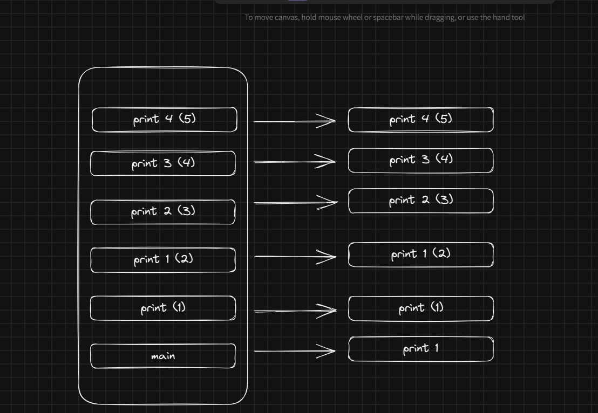
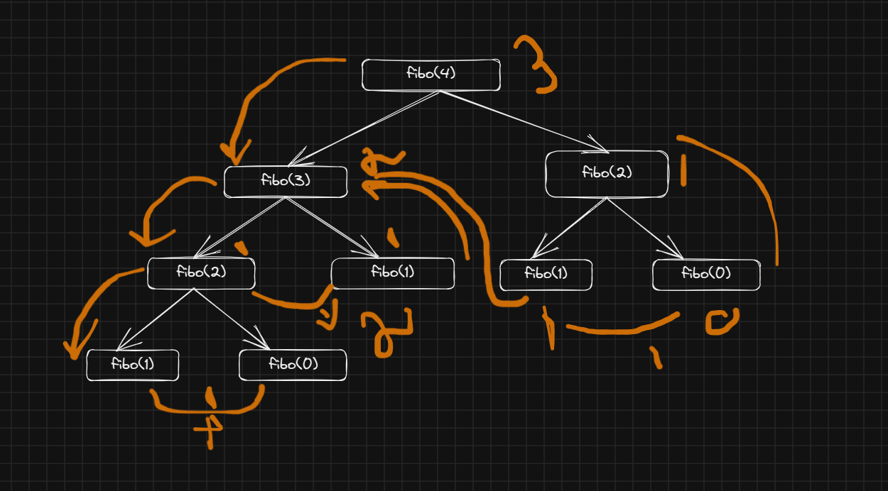

# 🔁 Recursion — Short Notes

## What is Recursion?
- A function **calls itself** to solve a **smaller subproblem** until a **base case** stops further calls.

## Call Stack Behavior
- Each call gets its own **stack frame** and **stays on the stack** until it returns.
- When a call **finishes**, its frame is **popped** off the stack.
- Control returns to the **caller**, and the program continues **step by step** (LIFO order).

# 📝 How to Understand & Approach a Recursive Problem

## Steps to Approach
1. **Break the Problem**
    - Check if the problem can be split into **smaller subproblems**.

2. **Write Recursive Relation**
    - Express the solution in terms of smaller inputs.

3. **Draw Recursive Tree**
    - Visualize calls step by step.

4. **Understand the Call Stack**
    - Functions remain in stack until they finish.
    - Flow is **LIFO (Last In, First Out)**.

---

## 📌 Working with Recursive Tree
- Trace **function flow**: how each call is stacked and returned.
- Identify **left calls** and **right calls** separately.
- Use **pen & paper**: redraw the recursive tree multiple times.
- Use a **debugger**: match the runtime stack with your drawing.
- Watch how **values return at each step**.
- Finally, control **comes back to the main function** after all calls finish.

