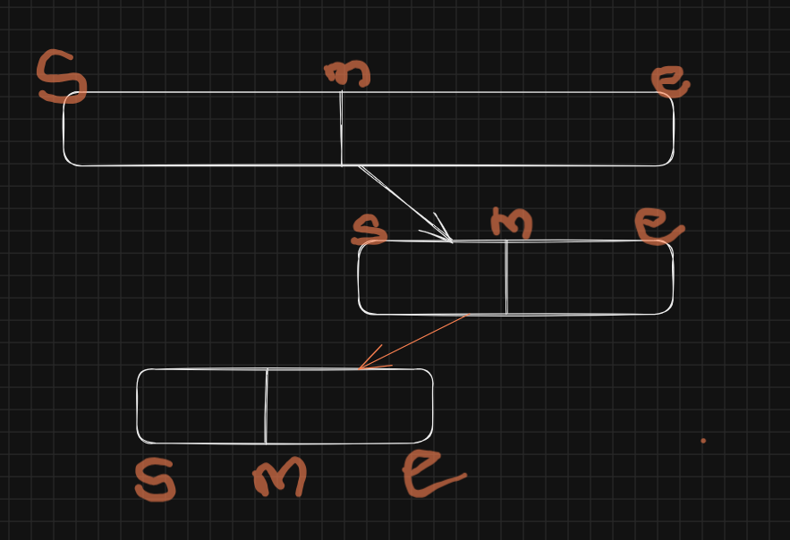

# 🔁 Recursion — Short Notes

## What is Recursion?
- A function **calls itself** to solve a **smaller subproblem** until a **base case** stops further calls.

## Call Stack Behavior
- Each call gets its own **stack frame** and **stays on the stack** until it returns.
- When a call **finishes**, its frame is **popped** off the stack.
- Control returns to the **caller**, and the program continues **step by step** (LIFO order).


# 📝 How to Understand & Approach a Recursive Problem

## Steps to Approach
1. **Break the Problem**
    - Check if the problem can be split into **smaller subproblems**.

2. **Write Recursive Relation**
    - Express the solution in terms of smaller inputs.

3. **Draw Recursive Tree**
    - Visualize calls step by step.

4. **Understand the Call Stack**
    - Functions remain in stack until they finish.
    - Flow is **LIFO (Last In, First Out)**.

---

## 📌 Working with Recursive Tree
- Trace **function flow**: how each call is stacked and returned.
- Identify **left calls** and **right calls** separately.
- Use **pen & paper**: redraw the recursive tree multiple times.
- Use a **debugger**: match the runtime stack with your drawing.
- Watch how **values return at each step**.
- Finally, control **comes back to the main function** after all calls finish.


# 🔍 Binary Search using Recursion

## Function Parts
1. **Arguments** → array, left index, right index, target value
2. **Return Type** → index of target (int), or `-1` if not found
3. **Body of Function** →
   - Compare mid element
   - If equal → return index
   - If target < mid → search left half
   - Else → search right half

---

## Steps
1. **Comparison** → check target with `mid` element
2. **Divide into Two Halves** → reduce problem size by half each step
3. **Recursive Call** → search left or right half until base case (element not found)

---

## Recurrence Relations
- **Linear Recurrence** → `T(n) = T(n-1) + O(1)` (example: linear recursion like factorial).
- **Divide & Conquer Recurrence** → `T(n) = T(n/2) + O(1)` (binary search).

---

## Example (Java)
```java
int binarySearch(int arr[], int left, int right, int target) {
    if (left > right) return -1;        // base case

    int mid = left + (right - left) / 2;

    if (arr[mid] == target) return mid;            // found
    else if (target < arr[mid])                    // search left
        return binarySearch(arr, left, mid - 1, target);
    else                                           // search right
        return binarySearch(arr, mid + 1, right, target);
}
